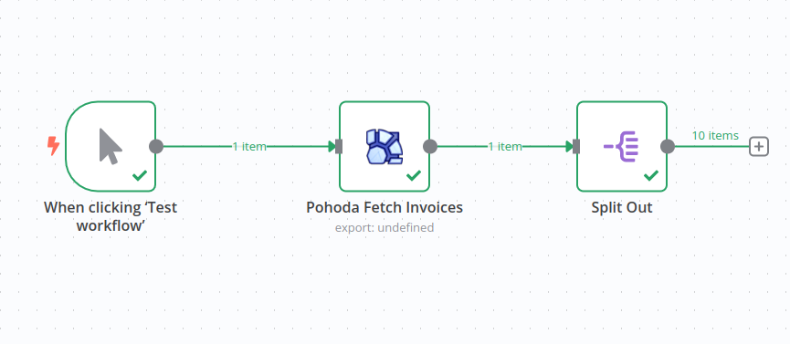
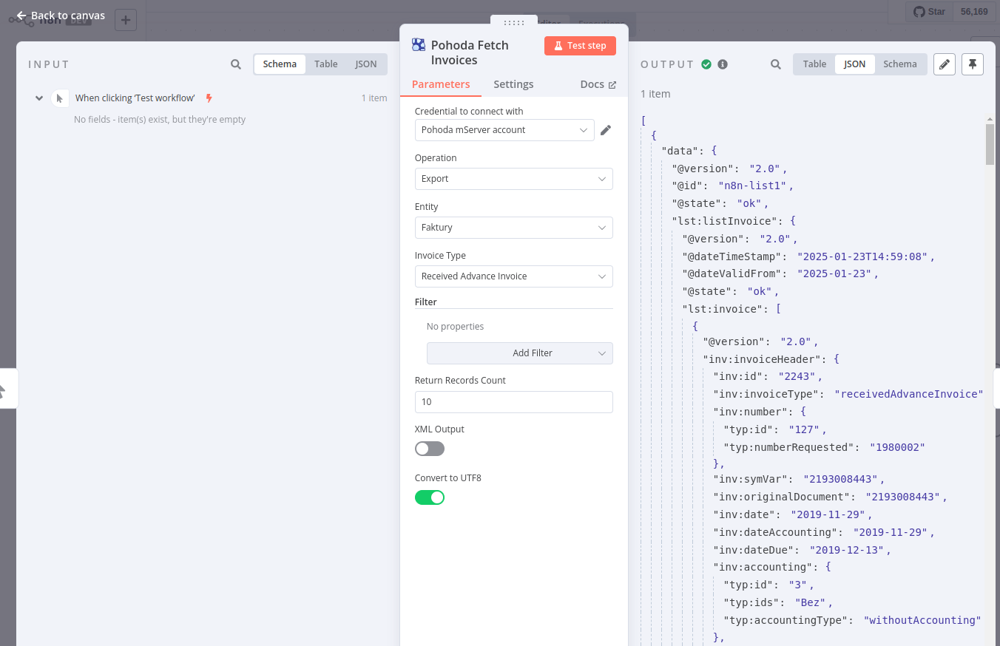
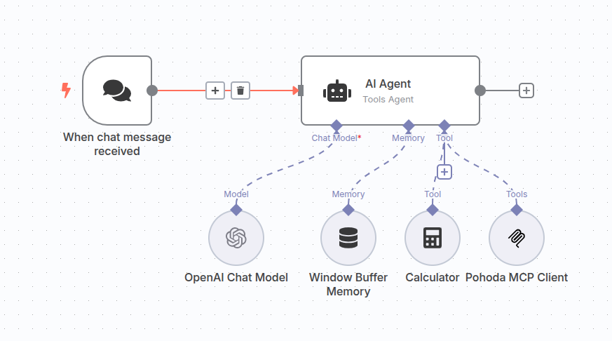
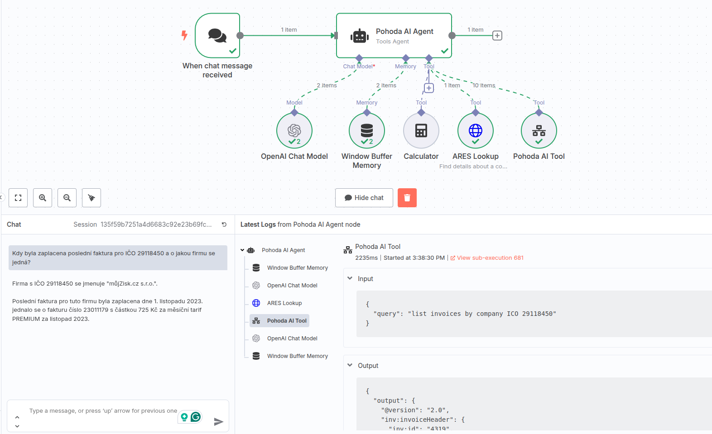
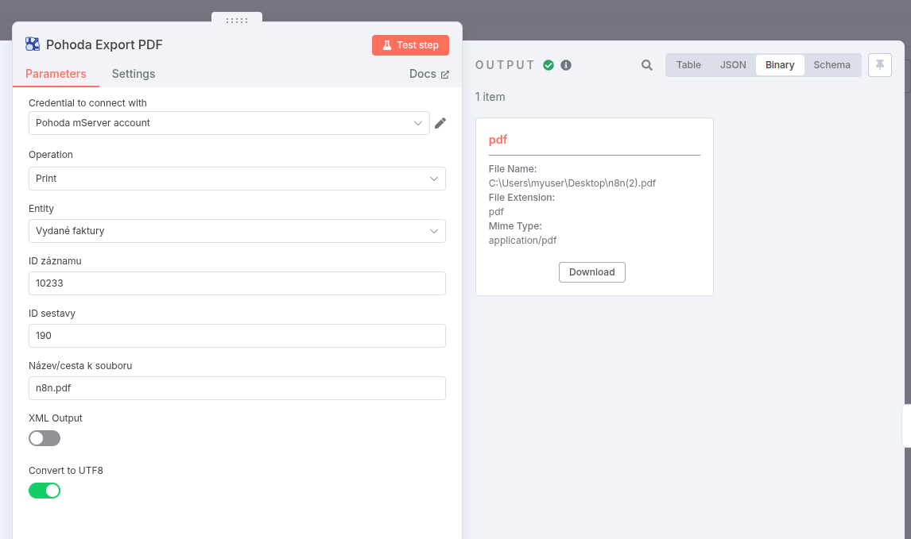
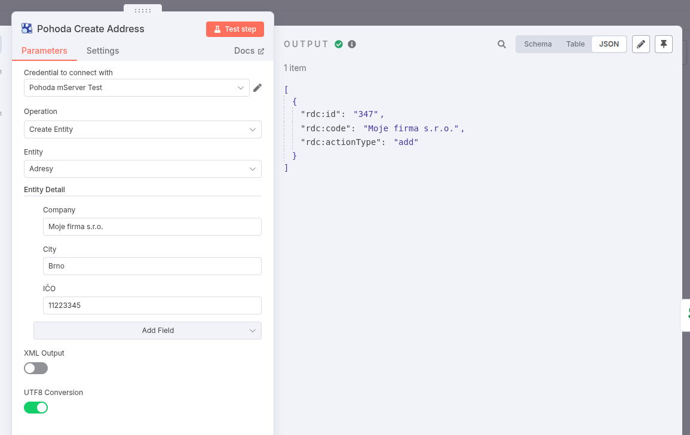
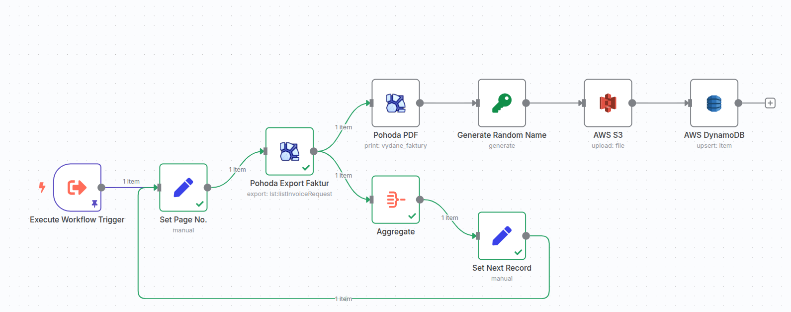
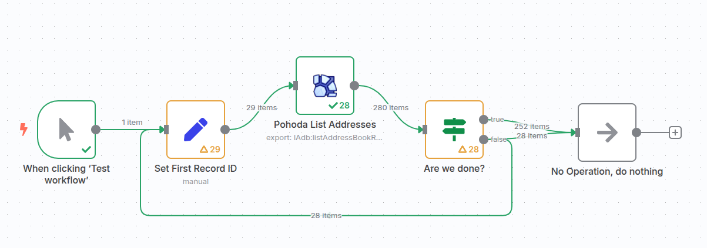

# n8n-nodes-pohoda

Toto je komunitní uzel pro [n8n](https://n8n.io/), který umožňuje integraci **Pohoda** mServer od Stormware do vašich n8n workflow.

**Pohoda** je účetní software využívající **mServer XML API**, které umožňuje automatizaci každodenních účetních operací. Díky integraci Pohody s n8n můžete plně automatizovat své obchodní procesy, obzvláště v kombinaci s AI nástroji.

### Screenshoty

*   **Ukázka workflow:**
		
*   **Nastavení uzlu:**
		
*   **Nastavení mServer klienta v Pohodě:**
		
*   **Příklad AI Agenta (kontrola faktury):**
		
*   **Export faktury do PDF:**
		
*   **Vytvoření adresy:**
		
*   **Workflow: Export do PDF a nahrání do AWS S3 + DynamoDB:**
		
*   **Export více záznamů (smyčka):**
		Operace `Export` vrátí seznam entit, které odpovídají filtru. Pro procházení (loop) více záznamů doporučujeme následující strategii:
		

[n8n](https://n8n.io/) je platforma pro automatizaci workflow [licencovaná pod fair-code licencí](https://docs.n8n.io/reference/license/).

## Obsah

- [Instalace](#instalace)
- [Podporované operace](#podporované-operace)
- [Přihlašovací údaje](#přihlašovací-údaje)
- [Kompatibilita](#kompatibilita)
- [Příklady použití](#příklady-použití)
- [Zdroje](#zdroje)
- [Jak testovat Pohoda mServer](#jak-testovat-pohoda-mserver)
- [Historie verzí](#historie-verzí)

## Instalace

Pro instalaci tohoto uzlu postupujte podle [instalačního návodu](https://docs.n8n.io/integrations/community-nodes/installation/) v dokumentaci komunitních uzlů n8n.

1.  Přejděte do **Settings > Community Nodes**.
2.  Vyberte **Install**.
3.  Zadejte `n8n-nodes-pohoda` do pole **Enter npm package name**.
4.  Souhlaste s riziky a klikněte na **Install**.

Po instalaci se uzel objeví v seznamu dostupných integrací.

## Podporované operace

Uzel umožňuje provádět následující hlavní operace s různými agendami a zdroji dat v Pohodě:

*   **Exportovat (Export):** Získání dat z Pohody na základě filtrů. Podporuje následující agendy/entity:
	*   Faktury (`lst:listInvoiceRequest`) - Včetně typů: Vydané, Přijaté, Vydané zálohové, Přijaté zálohové
	*   Příjemky (`lst:listPrijemkaRequest`)
	*   Prodejky (`lst:listProdejkaRequest`)
	*   Objednávky (`lst:listOrderRequest`)
	*   Výdejky (`lst:listVydejkaRequest`)
	*   Pokladní doklady (`lst:listVoucherRequest`)
	*   Nabídky (`lst:listOfferRequest`)
	*   Výroba (`lst:listVyrobaRequest`)
	*   Interní doklady (`lst:listIntDocRequest`)
	*   Poptávky (`lst:listEnquiryRequest`)
	*   Převod (`lst:listPrevodkaRequest`)
	*   Banka (`lst:listBankRequest`)
	*   Zakázky (`lst:listContractRequest`)
	*   Pohyby (`lst:listMovementRequest`)
	*   Účetní deník (PÚ) (`lst:listAccountancyRequest`)
	*   Adresy (`lAdb:listAddressBookRequest`)
	*   Zásoby (`lStk:listStockRequest`)
	*   Prodejní ceny (`lst:listSellingPriceRequest`)

*   **Vytvořit entitu (Create Entity):** Vytváření nových záznamů v Pohodě. Podporuje následující agendy/entity (dle výběru v UI):
	*   Adresy (`lAdb:listAddressBookRequest`)
	*   *(Poznámka: Další entity jako Faktury, Objednávky atd. jsou v UI volitelné pro 'Create', ale jejich plná implementace pro vytváření se může lišit. Aktuálně je v kódu explicitně implementováno vytváření pro Adresy.)*

*   **Informace o firmě (Company Info):** Získání základních informací o připojené firmě a stavu mServeru (nevyžaduje výběr entity).

*   **Tisk (Print):** Generování PDF tiskové sestavy pro existující záznam v Pohodě. Podporuje tisk z následujících agend:
	*   Adresář (`adresar`)
	*   Banka (`banka`)
	*   Cenové akce (`cenove_akce`)
	*   Cenové skupiny (`cenove_skupiny`)
	*   Členění skladu (`cleneni_skladu`)
	*   Evidenční čísla (`evidencni_cisla`)
	*   Interní doklady (`interni_doklady`)
	*   Inventura (`inventura`)
	*   Inventurní seznamy (`inventurni_seznamy`)
	*   Ostatní pohledávky (`ostatni_pohledavky`)
	*   Ostatní závazky (`ostatni_zavazky`)
	*   Pohyby (`pohyby`)
	*   Pokladna (`pokladna`)
	*   Převod (`prevod`)
	*   Přijaté faktury (`prijate_faktury`)
	*   Přijaté nabídky (`prijate_nabidky`)
	*   Přijaté objednávky (`prijate_objednavky`)
	*   Přijaté poptávky (`prijate_poptavky`)
	*   Přijaté zálohové faktury (`prijate_zalohove_faktury`)
	*   Přijemky (`prijemky`)
	*   Prodejky (`prodejky`)
	*   Prodejní ceny (`prodejni_ceny`)
	*   Reklamace (`reklamace`)
	*   Servis (`servis`)
	*   Sklady (`sklady`)
	*   Uživatelská agenda (`uzivatelska_agenda`)
	*   Vydané faktury (`vydane_faktury`)
	*   Vydané nabídky (`vydane_nabidky`)
	*   Vydané objednávky (`vydane_objednavky`)
	*   Vydané poptávky (`vydane_poptavky`)
	*   Vydané zálohové faktury (`vydane_zalohove_faktury`)
	*   Výdejky (`vydejky`)
	*   Výroba (`vyroba`)
	*   Výrobní požadavky (`vyrobni_pozadavky`)
	*   Zakázky (`zakazky`)
	*   Zásoby (`zasoby`)

## Přihlašovací údaje

Pro použití tohoto uzlu je třeba se autentizovat vůči mServer XML API Pohody.

1.  **Předpoklady**: Aktivní licence Pohoda s povoleným mServerem a přístup k mServer XML API. Ujistěte se, že mServer běží a je dostupný ze serveru, kde běží n8n.
2.  **Autentizace**: V n8n vytvořte nové přihlašovací údaje typu "Pohoda mServer Api". Budete potřebovat:
	*   **API Endpoint URL**: Adresa vašeho běžícího mServeru (např. `http://vas_server:port/xml` nebo `https://vas_server/xml`).
	*   **Company ID (IČO)**: Identifikační číslo vaší firmy v Pohodě.
	*   **Username**: Uživatelské jméno pro přístup k mServeru (nastavené v Pohodě).
	*   **Password**: Heslo pro přístup k mServeru.
3.  **Nastavení v uzlu**: V konfiguraci uzlu Pohoda vyberte vytvořené přihlašovací údaje.

## Kompatibilita

Uzel byl testován s následujícími verzemi:

*   **Pohoda**: `13907.6` (Datum sestavení: 12. 3. 2025) - *Poznámka: Datum se zdá být v budoucnosti, ověřte prosím skutečnou verzi.*
*   **n8n**: `v1.88.0` a novější

Očekává se kompatibilita i s jinými verzemi, ale nebyly explicitně testovány.

## Příklady použití

Tento uzel byl navržen tak, aby zjednodušil integraci Pohody do n8n workflow a umožnil napojení Pohoda ERP na AI nebo jiné systémy.

*   **Automatizace fakturace**: Použijte operaci "Exportovat" pro získání dat o objednávkách a následně "Vytvořit entitu" (až bude plně implementováno pro faktury) nebo jiný mechanismus pro generování faktur.
*   **Kontrola zaúčtování s AI**: Exportujte doklady (např. `lst:listInvoiceRequest`) a předejte data AI modelu (např. OpenAI nebo Gemini) pro kontrolu správnosti zaúčtování.
*   **Synchronizace zákaznických dat**: Použijte operaci "Vytvořit entitu" pro `lAdb:listAddressBookRequest` k přidání nových zákazníků z CRM do Pohody. Použijte "Exportovat" pro `lAdb:listAddressBookRequest` k získání dat pro aktualizaci CRM.
*   **Generování finančních reportů**: Použijte operaci "Tisk" pro generování PDF reportů (např. přehled pohledávek z agendy `vydane_faktury`) a jejich odeslání emailem nebo uložení.
*   **Automatické sledování plateb**: Exportujte neuhrazené faktury (`lst:listInvoiceRequest` s filtrem) a porovnejte je s daty z bankovní integrace (vyžaduje další uzly).
*   **Upozornění na stav zásob**: Pravidelně exportujte data o zásobách (`lStk:listStockRequest`) a pomocí logiky v n8n (např. IF uzel) zkontrolujte, zda zásoby klesly pod limit.
*   **Import a export dat**: Automatizujte export dat (např. objednávky `lst:listOrderRequest`) pro analýzu v externích nástrojích (např. Google Sheets).
*   **Sledování objednávek**: Po vytvoření výdejky (`lst:listVydejkaRequest`) exportujte její detaily a použijte je pro informování zákazníka nebo integraci se systémem dopravce.
*   **Zpracování vratek**: Vytvořte workflow, které na základě externího triggeru (např. z e-shopu) použije operaci "Vytvořit entitu" (až bude implementováno pro dobropisy) k vytvoření dobropisu v Pohodě.
*   **Automatizace reportů o prodeji**: Naplánujte pravidelné exporty prodejních dat (např. `lst:listProdejkaRequest`) a jejich agregaci pro reportingové účely.
*   **Propojení / můstek**: Propojte Pohoda data s programy jako například s Abra Flexi, Shoptet, WooCommerce, Prestashop a dalšími programy.

Tyto nápady vám mohou pomoci efektivně využít n8n a zjednodušit pracovní procesy spojené s Pohoda ERP.

## Zdroje

*   **Dokumentace n8n**: [https://docs.n8n.io](https://docs.n8n.io)
*   **Dokumentace mServer XML API Pohody**: [https://www.stormware.cz/prirucka-pohoda-online/Datova_komunikace/XML_import-export/](https://www.stormware.cz/prirucka-pohoda-online/Datova_komunikace/XML_import-export/) (Vyžaduje přihlášení)

## Jak testovat Pohoda mServer

Pro základní ověření funkčnosti mServeru můžete použít nástroj jako `curl`. Výchozí uživatel v mServeru (pokud není změněn) je často `@` s prázdným heslem. Přihlašovací údaje `Username:Password` zakódujte do Base64 (pro `@:` je to `QDo=`).

Příklad `curl` příkazu pro odeslání XML požadavku (uloženého v souboru `req.xml`) na lokální mServer a převedení odpovědi z WINDOWS-1250 na UTF-8:

```bash
# Nahraďte IP adresu a port adresou vašeho mServeru
# Soubor req.xml musí obsahovat validní XML požadavek pro Pohodu
curl -d @req.xml -X POST \
     -H "STW-Authorization: Basic QDo=" \
     -H "Content-Type: application/xml" \
     http://10.0.111.111:3880/xml \
| iconv -f WINDOWS-1250 -t UTF-8
```
